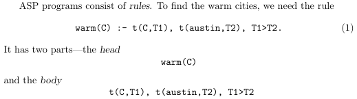

# _Answer Set Programming_ (ASP)
## Clingo
<p align="justify">Utilizamos la herramienta <a href="https://potassco.org/clingo/">clingo</a> para resolver problemas de programación de conjuntos de respuestas (ASP). Para ello, se debe escribir un programa en el lenguaje de programación de conjuntos de respuestas (ASP) y ejecutarlo con la herramienta clingo. El programa debe ser escrito en un archivo de texto con extensión <code>.lp</code> y se ejecuta con el comando <code>clingo &ltarchivo.lp&gt</code>.</p>

<p align="justify">Los programas ASP se componen de hechos y reglas. Los hechos son declaraciones que se asumen verdaderas y son de la forma <code>p(a1, a2, ..., an).</code> donde no necesariamente existen argumentos. Es más fácil viéndolo de la forma <code>fact.</code>. Las reglas son declaraciones que se asumen verdaderas si se cumplen sus antecedentes y son de la forma <code>head :- body.</code>. El <i>body</i> puede incluir varios átomos separados por comas, indicando que todos ellos deben cumplirse para que la regla sea verdadera. Estos se conocen como _constraints_ y también se pueden incluir comparaciones como <code>X < Y</code> o <code>X = Y</code>.</p>

<p align="center">
    
</p>

<p align=justify>Al ejecutar el programa, clingo retorna un <i>Answer Set</i> o un conjunto de <b>modelos</b>. La aparición de más de un modelo se puede lograr mediante la inclusión de <i>choice rules</i>. Estas son de la forma ...</p>

<p align=justify>
    Para ver solo las apariciones de un predicado en los modelos, se puede agregar la línea <code>#show predicado/N</code> donde <code>N</code> es el número de "argumentos" del predicado. Por ejemplo, para ver solo las apariciones de <code>fact</code> en los modelos, se puede agregar la línea <code>#show fact/0</code>.
</p>
## Semántica de programas sin variables
### Reglas
#### Definición
Una **regla** en programación en lógica es un objeto de la forma $Head \leftarrow Body$, donde $Head$ y $Body$ son conjuntos de átomos.
#### Ejemplos:
* $\{u\}\leftarrow\{t,r\}$ en clingo: `u :- t, r.`
* $\{t\}\leftarrow\{\}$ en clingo: `t.`
* $\{\}\leftarrow r$ en clingo: `:- r.` Esta regla es una especie de filtro.
* $\{p,q\}\leftarrow\{r,s\}$ en clingo: `p,q :- r,s.`

### Programas
#### Definición
Un **programa** es un conjunto de reglas.
#### Programas básicos
Un programa $\Pi$ es un **programa básico** cuando cada regla $H\leftarrow B$ en $\Pi$ es tal que $H$ contiene exactamente un átomo.
### Modelos
#### Computando el modelo de un programa básico
Dado un programa básico $\Pi$, el siguiente algoritmo retorna el modelo de $\Pi$:
1. $M:=\{p|\text{ para toda regla }\{p\}\leftarrow\empty\in\Pi\}$ (la regla es de la forma $\{p\}\leftarrow\empty$).
2. Para cada regla de la forma $H\leftarrow B \in\Pi$ tal que $B\subseteq M$ se cumple que $M:=M\cup H$.
3. Si $M$ cambió en 2. entonces volver a 2. En caso contrario retornar $M$ y $M$ es el modelo.
#### Definición
$M$ es un **modelo** de un programa $\Pi$ instanciado y sin negación si y solo si $M$ es un conjunto minimal (respecto de la relación de subconjunto) de átomos de $\Pi$, tal que si $Head\leftarrow Body \in \Pi$ y $Body\subseteq M$, entonces $Head \cap M \neq\empty$.

### Reglas con negación
#### Definición
Una **regla** en programación en lógica es un objeto de la forma $Head \leftarrow Pos, not(Neg)$, donde $Head$, $Pos$ y $Neg$ son conjuntos de átomos.
#### Ejemplos:
* $\{p,q\}\leftarrow\{r,s\},not(\{t\})$ en clingo: `p;q :- r,s, not t.`
* $\{t\}\leftarrow\empty,not(\{\})$ en clingo: `t.`
* $\{\}\leftarrow not(\{r,s\})$ en clingo: `:- not r, not s.`

### Reducción y conjunto respuesta
#### Definición
La **reducción** de un programa $\Pi$ relativa a un conjunto $X$, denotada como $\Pi^X$, es la que resulta de hacer:
1. $\Pi^X:=\Pi$
2. Borrar toda regla $Head\leftarrow Pos\cup not(Neg)$ de $\Pi^X$ cuando $Neg\cap X \neq \empty$.
3. Reemplazar cada regla $Head\leftarrow Pos\cup not(Neg)$ en $\Pi^X$ por $Head\leftarrow Pos$ cuando $Neg\cap X = \empty$.
#### Teorema
$X$ es un modelo de un programa con negación $\Pi$si y solo si $X$ es un modelo para $\Pi^X$ 

### Restricciones de cardinalidad
<p align=justify>
También llamadadas <i>choice rules</i>, son aquellas escoger entre diferentes átomos en el <i>head</i> de una regla, teniendo un <code>head</code> de la forma <code>{pre1; pre2}</code> y nos entrega un modelo para toda combinación posible de los átomos en el <i>head</i>. Se pueden añadir restricciones de cardinalidad al definir el rango, por ejemplo <code>1{pred1, pred2}1</code>, el cual muestra los modelos donde aparece exactamente un átomo de los dos en el <i>head</i>.
</p>
<p align=justify>
Las restricciones de cardinalidad pueden incluir intervalos y <i>pools</i>. Por ejemplo, la regla <code>{p(1..3)}</code> es lo mismo que <code>{p(1); p(2); p(3)}</code>. Asímismo, <code>{p(a; b; c)}</code> es lo mismo que <code>{p(a); p(b); p(c)}</code>.
</p>

### Sets independientes

```
% Colorear los vértices de un grafo de modo que no haya dos vértices adyacentes con el mismo color.

% input: conjunto vertex/1 de vértices del grafo G; conjunto edge/2 de aristas del grafo G; conjunto color/1 de colores disponibles.

1 { color(X, C) : color(C)} 1 :- vertex(X).
% logrado: para todo vértice X existe un único color C tal que color(X, C) (C es el color del vértice X).
```
