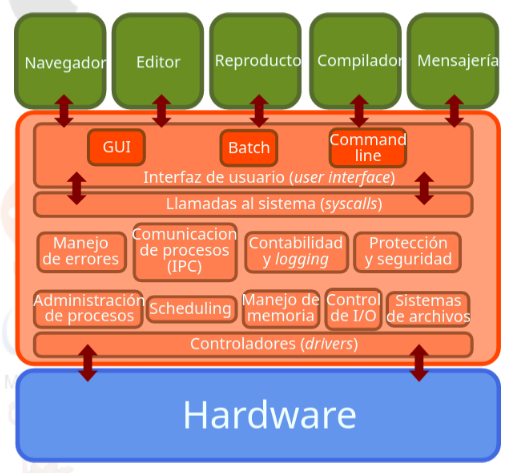
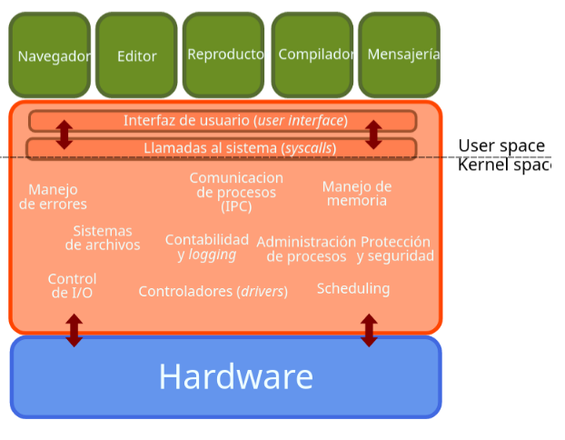
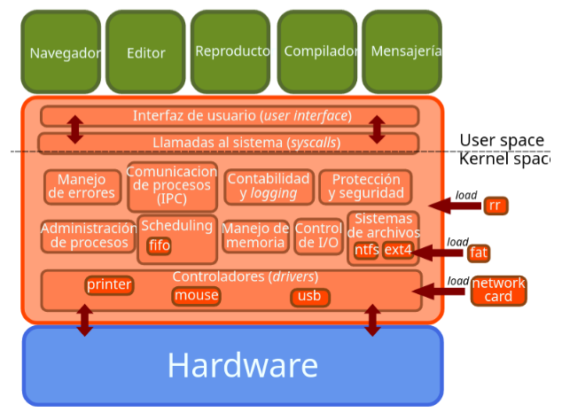
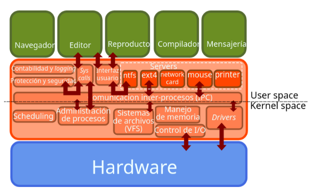
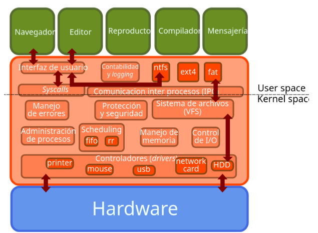

# Introducción a los sistemas operativos
Keywords: kernel, monolítico, microkernel, kernel híbrido, user interface, GUI, CLI, BATCH. 

## ¿Qué es un sistema operativo? 

Un sistema operativo está compuesto de un kernel y de los programas del sistema. Es nuestro servidor más importante. 

## Roles del OS 
### ¿Para qué queremos usar un sistema operativo? 

1. Nos abstrae del hardware (y de sus ciclos fetch, decode, execute). 

2. Permite compartir recursos entre rutinas (rol de administrador de recursos).  

3. Hace más cómodo el uso de hardware.   

4. Permite correr diferentes arquitecturas. 

## Estructura de un OS 
### ¿Qué hay dentro de un OS? 
* Administración de procesos
* Manejo de memoria
* Sistemas de archivos
* Protección y seguridad
* Control de I/O
* Manejo de errores
* Comunicación interprocesos
* Contabilidad / logging
* Controladores 
* ...

 

## _Syscalls_: cómo se invocan los servicios del sistema operativo
Permiten la comunicación de los programas con el OS. Los programas invocan servicios del OS. 
Los OS proveen librerias en algún lenguaje de programación para invocar las _syscalls_.  
* Cada vez que un programa desea solicitar algo al sistema operativo, debe invocar una _syscall_.
* Es pedirle al OS que haga algo por nosotros.
* El OS provee interfaces de usuario que enmascara las _syscalls_.

## ¿Cómo interactuamos con el OS? 
1. GUI 
2. CLI 
3. Batch (lotes) 

# Kernel 

* El kernel tiene control completo sobre el hardware. 
* Es el único programa que se ejecuta en modo privilegiado. 
* El resto se ejecuta en modo usuario. 

## Arquitecturas de kernel 

### Kernel monolítico 
* Servicios para el sistema y para el usuario en el mismo espacio.
* Todo dentro de un solo programa. 
* Todos los servicios se ejecutan en modo privilegiado o modo kernel. 
* La falla de un servicio compromete al kernel. 
* Ejecución más rápida. 

 

Componentes pueden ser incluidos al momento de compilar, o bien durante la
ejecución como módulos.Módulos extienden al kernel. Módulos se ejecutan en el
espacio del kernel. Ayuda a controlar el tamaño del kernel (_footprint_).

 

#### Desventajas de un _kernel_ monolítico
Como todos los archivos se ejecutan en una sola imagen, si falla algún servicio, falla todo el sistema. Si el usuario necesita agregar cualquier servicio nuevo, entonces el usuario necesita modificar todo el sistema. No es fácil de mantener y depurar.
### Microkernel 

* Solo servicios básicos en el _kernel_. 
* Las funcionalidades se ejecutan en el _user space_. 
* Errores en los servicios no comprometen todo el _kernel_. 
* _Kernel_ más pequeño, sencillo y fácil de portar. 
* Ejecución con _overhead_ por comunicación.
* Procesos se comunican a través de paso de mensajes.
* Ejemplos: Mach, GNU/Hurd, MINIX 3.

#### Desventajas de un _microkernel_
La ejecución en microkernel es lenta, ya que, la comunicación entre la aplicación y el _hardware_ del sistema se establece a través del paso de mensajes.

 

#### Aislamiento de fallas
* El diseño de un _microkernel_ ayuda a aislar las fallas y evitar que afecten a todo el sistema. Si un servidor u otro componente falla, se puede reiniciar o reemplazar sin causar interrupciones al resto del sistema. Modularidad.
* Devido a que el núcleo y los servidores se pueden desarrollar y mantener de forma independiente, el diseño del _microkernel_ permite una mayor modularidad. Esto puede facilitar la adición y eliminación de funciones y servicios del sistema operativo.

### Kernel híbrido 
* Construido como monolítico con módulos con funcionalidades que se ejecutan en el user space. 

    

## Modos de protección
Al iniciar el computador, se ejecuta código de la tarjeta madre 
* BIOS: Basic Input Output System, o bien
* UEFI: Unified Extensible Firmware Interface
Este código tiene dos misiones fundamentales:
* Inicializar/identificar el _hardware_.
* Ubicar y arrancar mediante un _bootloader_ el _kernel_ en modo privilegiado (el _kernel_ es el único programa que se ejecuta en modo privilegiado).

El _hardware_ tiene dos modos de protección:
* _Kernel mode_: acceso completo al _hardware_.
* _User mode_: acceso a un set restringido de instrucciones.

### Instrucciones privilegiadas
* Modificar el vector de interrupciones
* Acceder a dispositivos de I/O
* Modificar el _timer_ del computador
* Detener el computador (HLT)
* Cambiar el modo de protección
* Modificar tablas de acceso a memoria.
* Almacenar estado de la máquina

El _hardware_ moderno posee 4 o más modos de protección, denominados anillos. Esto permite implementar virtualización.

## Flujo usuario-_kernel_ al momento de ejecutar
Mientras nadie lo llame, el sistema operativo no hace nada.
* Primero: El programa de usuario genera una *trap*: interrupción por _software_.
* Segundo: Se pasa el control al sistema operativo: _kernel space_.
* Tercero: El sistema operativo realiza la tarea solicitada.
* Cuarto: El sistema operativo devuelve el control al programa de usuario: _user space_.

Links 
1. Página del curso: http://iic2333.ing.puc.cl/slides/0-os.html#/ 
2. Linux cluster: https://www.suse.com/suse-defines/definition/linux-cluster/ 
3. TUI: https://en.wikipedia.org/wiki/Text-based_user_interface 
4. Cómo crear tu propia syscall: https://brennan.io/2016/11/14/kernel-dev-ep3/ 
5. Página de proyectos: https://brennan.io/projects/ 