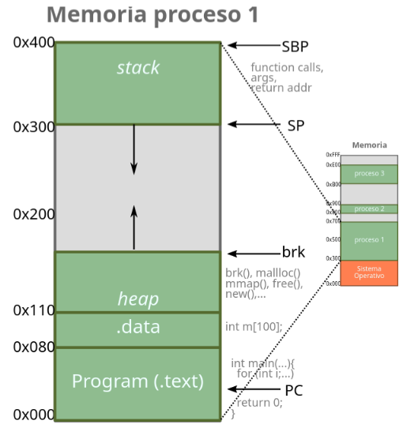
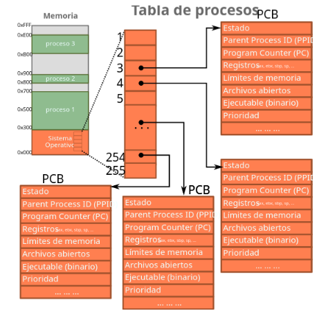
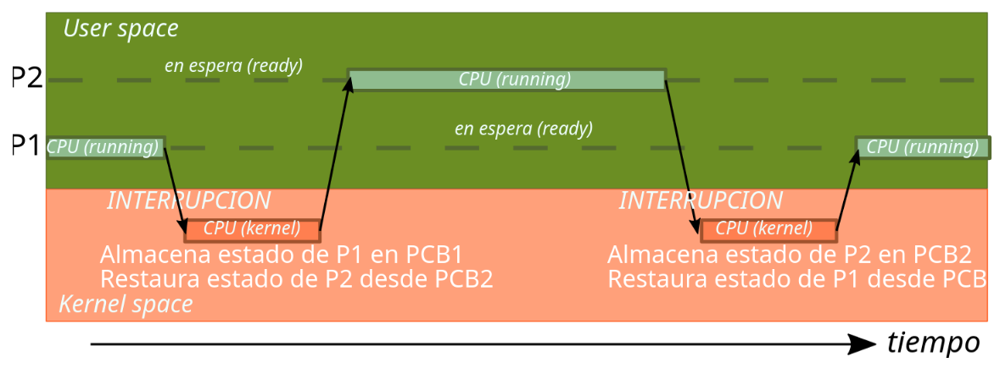
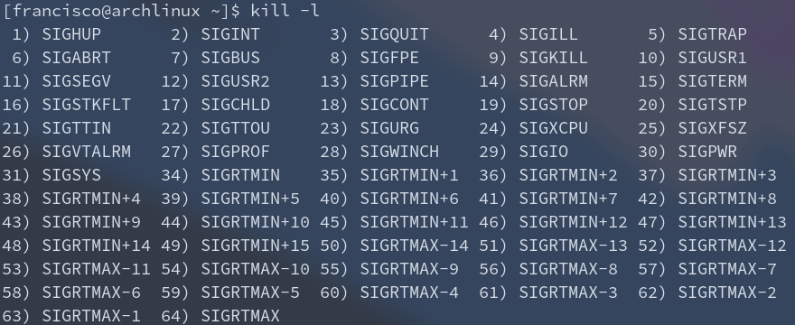

# Procesos
Keywords: procesos, tabla de procesos, 
## ¿Qué es un proceso (_task_)? 

* Código en ejecución (código + recursos(memoria, archivos, sockets, I/O, etc)) 
* La multiprogramación permite mantener múltiples procesos en memoria. 

La CPU puede atender los procesos en algún orden (_scheduling_), de manera que, si la CPU atiende "simultáneamente" varios procesos, entonces tenemos _multitasking_. 

Multitasking involves overlapping and interleaving the execution of several programs. This is often achieved by capitalizing on the difference between a computer’s rapid processing capacity and the slower rates of its input/output devices. 

## Composición y representación de un proceso 
* Código (.text): informacipon estática 
* Datos (.data): variables globales 
* Heap: memoria asignada dinámicamente (en runtime) 
* Stack: cada ítem del stack representa un llamado a función (call frame) y contiene: 
    - Parámetros 
    - Variables locales 
    - Lugar de retorno (donde estaba anteriormente la ejecución: PC) 
    - Stack Base Pointer SBP 
    - Stack Pointer SP 

  

El sistema operativo mantiene la **Tabla de Procesos**. Esta almacena la información de cada proceso en su respectivo _Process Control Block_ (PCB), el que a su vez almacena: 
* Estado del proceso 
* PID 
* PC: _Program counter_
* Registros de CPU: estado de ejecución 
* Información de _scheduling_: prioridades, tipo de cola, … 
* Información de memoria: límites, tabla de páginas/segmentos, … 
* Contabilidad (_accounting_) 
* Información de I/O: archivos y dispositivos abiertos, … 

  

## _Multitasking_ 
El cambio de procesos se conoce como context switch 
* OS actúa luego de una interrupción (syscall, timer, evento, …) 
* OS almacena estado de registros de P1 en PCB1. P1 queda "en pausa" 
* OS restaura estado de registros desde PCB2 
* P2 continúa su ejecución 

    

## ¿Cómo se crean los procesos? 
Durante la inicialización del kernel se crea un proceso raíz con PID=1 
* Linux: systemd, init, upstart 
* MacOS: launchd 
* Windows: InitialSystemProcess, System 

### Syscall `fork()` 
¿Quién sigue ejecutando? 
* Parent y Child siguen ejecutando concurrentemente desde la instrucción de retorno del `fork()`.
* Ambos existen en la memoria del computador 
* Cuál proceso continúa en estado running depende de la implementación 

### ¿Qué "personalidad" tiene el child? 
* El hijo es un duplicado casi exacto del padre 
* El hijo en un nuevo proceso (otro espacio de direcciones) 
* El hijo copia la memoria del padre a su nuevo espacio 
* El hijo y el padre continúan ejecutando desde el retorno del fork() 

`fork()` retorna el PID del nuevo proceso al padre y retorna 0 al nuevo proceso. 

### Syscall `exec()` 
* Carga un binario en memoria reemplazando el código de quien lo llamó, e inicia su ejecución. 
* El programa nuevo se "roba" el proceso (la memoria es sobreescribible) 
* Solamente retorna en caso de que falle.

### Syscall `wait()` 
Espera el término de un proceso hijo. 

### Syscall `exit()`
Termina el proceso con un código de retorno dado y lo entrega al padre. 

## Señales, huerfanos y zombies 
### Syscall `kill()` 
* Envía una señal a otro proceso. 
* `kill –l` permite ver las señales disponibles. 
* SIGTERM indica al proceso que debe terminar. 
* SIGKILL elimina al proceso de la tabla de procesos (sin piedad). 

  

### Procesos huérfanos 
Linux:  
* Cuando un padre termina (_exit_) o muere (_kill_), sus hijos quedan huérfanos y pasan a ser hijos de `init` o `systemd`.  
* Sin embargo, en condiciones complicadas puede parecer que los hijos si mueren. 
* Init hace `wait()` periódicamente por sus hijos. 

### Procesos zombies 
Linux:  
* Cuando un proceso termina y su padre no hace `wait()`  
* Proceso terminado no se borra inmediatamente de la tabla de procesos 
* El proceso tampoco ejecuta nada, porque terminó. 
* Proceso queda en estado zombie hasta que el padre hace `wait()` 