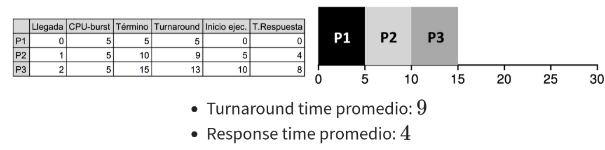
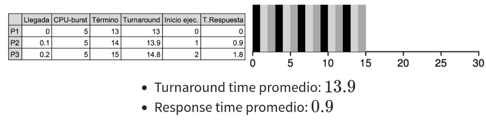
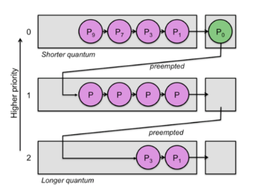
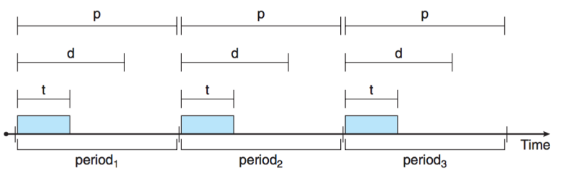
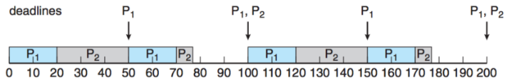

# _Scheduling_
## Planificación de CPU: ¿Cómo podemos gestionar los recursos que tenemos para lograr _multitasking_?
Tenemos:
* Múltiples procesos en memoria (multiprogramación) ordenados en una tabla de PCBs. Si no tuvieramos multiprogramación no necesitaríamos planificar.
* Algunos procesos en estado _ready_.
* CPU que puede atender un solo proceso a la vez.

Queremos:
* Multitasking: asignar tiempo a múltiples procesos.

Gestionamos los recursos a través del _scheduler_, el cual puede ser visto como un sistema de manejo de colas.

</img>

Recordemos que, en el caso de la _syscall_ <code>fork()</code> para Linux, el padre también sigue ejecutando.
## Niveles de _scheduling_
* _Long-term scheduler_:
  - Admite procesos en la cola _ready_.
  - Determina el grado de multiprogramación (cantidad de procesos en memoria).
* _Medium-term scheduler_:
  - Modifica temporalmente el grado de multiprogramación.
  - Ejecuta _swapping_ copiando memoria RAM al disco y del disco a la RAM.
* _Short-term scheduler_ (aka _dispatcher_):
  - Selecciona un proceso de la cola _ready_ para ejecutar.
  - Ejecuta el cambio de contexto.

</img>

### ¿Y si estamos siempre haciendo _scheduling_ en vez de ejecutar programas?
_Scheduling_ es importante para el _multitasking_... pero _scheduling_ y _context switch_ son solo _overhead_:
* ¿Qué pasa si el _scheduler_ o el _context switch_ toman más tiempo de lo que toma el proceso?
* ¿Qué pasa si se le asigna poco tiempo a cada proceso?
* ¿Qué pasa si hay muchos procesos _ready_?
La contención o atascamiento de procesos se refleja en el concepto de _thrashing_:

</img>

## Modelo de ejecución de un proceso
No todos los procesos se comportan igual. Los procesos en general alternan entre dos fases:
* Uso de CPU (_CPU brust_)
* Espera por I/O (_I/O-brust_)

y suelen estar dominados por uno u otro, de modo que, a los procesos fuertemente dominados por el uso de CPU se le conoce como _CPU intensive_ mientras que a los procesos fuertemente dominados por espera de I/O se les conoce como _I/O intensive_ o procesos interactivos.

</img>

### Una CPU bajo el 100% está subutilizada.
El tiempo que gasta un proceso en espera obviamente influye en la utilización de la CPU:
* $p$ es el porcentaje de tiempo en espera de I/O.
* $p^n$ es la probabilidad que $n$ procesos estén esperando por I/O.
* Utilización de la CPU es $CPU_n=1-p^n$
Una vez que llego al 100% ya no tiene mucho sentido agregar más procesos.

</img>

## Tipos de _scheduling_
Podemos clasificar las políticas de _scheduling_ según tipo de interrupción y según objetivo.
Según tipo de interrupción:
* _Preemptive_ (expropiativo):
  - Utiliza interrupciones (ej: de reloj _timer_) para decidir cuando sacar un proceso de ejecución.
  - Hoy en día los OS suelen utilizar _schedulers_ de tipo expropiativo. 
* _Non-Preemptive_ (colaborativo o no-expropiativo): Permite que un proceso ejecute hasta que:
  - El proceso deja voluntariamente la CPU, ó
  - El proceso se bloquea en I/O, ó
  - El proceso termina.
  

Según objetivo:
* _Batch_: trabajo por lotes. Sin interacción.
  - Mantener la CPU lo más ocupada posible.
  - Minimizar _turnaround time_: tiempo desde envío hasta término.
  - Maximizar _throughput_: número de trabajos por unidad de tiempo.
* _Interactive_: 
  - Minimizar tiempo de respuesta.
  - Satisfacer usuarios.
  - Gran parte de los OS implementan _schedulers_ interactivos.
* _Real Time_:
  - Tiempo de respuesta debe ser predecible.
  - Alcanzar _deadlines_.
  - Un buen ejemplo es un sistema digital de frenado de un auto.

Todos los tipos de _scheduler_ tienen el objetivo de _fairness_: que todos los procesos tengan un tiempo razonable de ejecución.

# Algoritmos de _Scheduling_ 
## Algoritmos de _batch scheduling_
### _First-come, First-served_ (FCFS)
Orden de llegada. Cola FIFO

</img>

**Importante entender la tabla y el gráfico.**
  
_Turnaround_ promedio de 109. Observar la diferencia de _turnaround_ si el orden de llegada hubiese sido P2 en $t=0$, P1 en $t=1$ y P3 en $t=2$. En este caso el _turnaround_ sería de 79.
  
Si bien es sencillo de implementar, depende mucho del orden en el que llegan los procesos:
* _Non-preemtive_
* Simple
* Poco predecible. _Convoy effect_

### _Shortesr Job First_ (SJF)
El más corto primero.

</img>

_Turnaround_ promedio de 49.
* El algorítmo es óptimo :)
* No sabemos cuánto demora cada _CPU-brust_ :(
* Esta versión es _non-preemptive_. La versión _preemptive_ es _Shortest Remaining Time Next_ la cual escoge al que le queda menos tiempo. Este tiempo se debe estimar lo que puede agregar _overhead_.
* Posible inanición (_starvation_) de procesos largos x.x (si me demoro mucho puede que nunca me toque)

## Algoritmos de _scheduling_ interactivos

Para este tipo de algoritmos, lo que más importa es que los tiempos de respuesta sean mínimos. En otras palabras, estos algoritmos tienen como métrica principal el <i>response time</i>. El tiempo de respuesta es el tiempo que pasa desde que el usuario envía un trabajo hasta que el trabajo comienza a ejecutarse.

</img>

### _Round Robin_ (RR)
* Asigna un tiempo de ejecución (_quantum_, _time slice_) fijo a cada proceso. 
* Cuando el tiempo de ejecución de un proceso termina, el proceso es suspendido y se pasa al siguiente proceso en la cola.
* El tiempo de ejecución de cada proceso es el mismo y se asigna en forma circular.
* De tipo <i>preemptive</i>.

</img>

* Con $n$ procesos, cada uno recibe $\frac{1}{n}$ de CPU. 
* Ningún proceso espera más de $(n-1)\times q$ para ejecutar.
* Altamente dependiente de la elección de $q$:
  - Si $q$ es muy grande, el algoritmo se comporta como FCFS.
  - Si $q$ es muy pequeño, puede generarse _thrashing_ por muchos cambios de contexto.

### _Priority Scheduling_
* Cada proceso tiene una prioridad.
* Cuando hay prioridades iguales, se aplica FCFS o RR.
* SJF es un caso particular de este algoritmo.
* Prioridades pueden ser estáticas o dinámicas.
* Puede producirse inanición (_starvation_) de procesos de baja prioridad.
* Para evitar _starvation_ se puede utilizar _aging_. Este mecanismo incrementa artificialmente la prioridad de los procesos que llevan más tiempo esperando.

### _Multi-level Feedback Queue Scheduling_
* Buscamos optimizar el _turnaround time_ y minimizar el _response time_.
* Se utilizan múltiples colas de procesos con diferentes niveles de prioridad.
* Tiene varias reglas:
  1. Si $priority(A)>priority(B)$, ejecutar $A$.
  2. Si $priority(A)=priority(B)$, ejecutar $A$ y $B$ con RR.
  3. Los procesos se ingresan en la cola con mayor prioridad.
  4. Si un proceso utiliza todo su tiempo de ejecución, se pasa a la cola de menor prioridad. 
  5. Después de un tiempo $S$, todos los procesos se mueven a la cola con mayor prioridad.

  </img>

## Algoritmos de _real time scheduling_
### Procesos de tiempo real
* Poseen _deadlines_ y períodos de ejecución.
* Sistema debe determinar si el proceso puede ser ejecutado dado el _deadline_ $d$, período $p$ y tiempo de ejecución $t$.
* En cada período el proceso debe avanzar en su ejecución una vez.

  </img>

### Algoritmo _Rate Monotonic Scheduling_ (RMS)
* A cada proceso se le asigna una prioridad $\frac{t_i}{p_i}$
* Es un algoritmo estático, de modo que podría perder _deadlines_.

  </img>

### Algoritmo _Earliest Deadline First_ (EDF)
* Es dinámico, eligiendo siempre el proceso con _deadline_ más cercana.