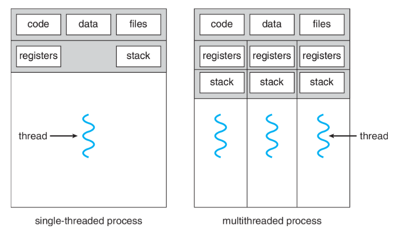
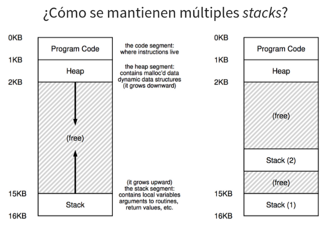
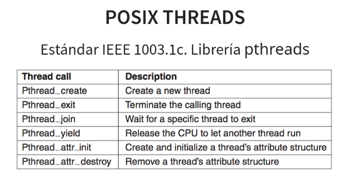

# Threads 
Un _thread_ es parecido a un proceso, pero más liviano. Es la unidad básica de uso de CPU
* Thread ID (TID)
* Program Counter (PC)
* Registros
* Stack

El resto está compartido con otros _threads_ del mismo proceso.

Los procesos pueden tener uno o más threads:

    

Cuando hablamos de procesos distintos estamos hablando de espacios de memoria distintos, en cambio, cuando hablamos de threads distintos estamos hablando de distintos puntos de ejecución dentro del mismo espacio de memoria: comparten el mismo código, la misma sección de datos globales, los mismos archivos, el mismo heap. Pero tienen su propio stack y sus propios registros y PC.

## ¿Por qué usar threads?
* Ayudan a programar mejor nuestro código haciéndolo más simple (organizándolo mejor).
* Pueden ayudar a paralelizar/distribuir tareas. No necesariamente ejecutan paralelamente.

## Modelo de threads
### ¿Qué comparten los threads?
* Espacio de memoria
* Variables globales
* Archivos abiertos
* Procesos hijos
* Alarmas pendientes
* Señales y handlers
* Información de accountability

### ¿Qué no comparten los threads?
* Stack
* Registros (incluyendo PC)
* Estado

    </img>
    </img>

La función `printf` es una función que no es thread-safe. Si dos threads llaman a `printf` al mismo tiempo, el resultado puede ser que uno de los dos threads no imprima nada, o que se mezclen los resultados de ambos threads.

## Implementación de threads
Existe algunos aspectos que dependen de cómo se implementen los threads:
* Semántica de `fork` y `exec`
* ¿Qué threads se suscriben a las señales?
* ¿Quienes se bloquean?

### Existen tres opciones sobre la implementación de threads:
1. User-space threads:
    * Portable :)
    * Context switch y scheduling más rápido :)
    * Mejor escalabilidad (usa memoria del proceso) :)
    * Llamadas a syscalls pueden bloquear a los procesos :(
    * Requiere de scheduling cooperativo (no hay timers o preemptions) :( no hay manera de mandar señales solamente a un thread, solo se puede al proceso completo.

2. Kernel-space threads:
    * No requiere bibliotecas. Soporte nativo.
    * Syscalls no bloquean a los procesos :)
    * Syscalls más costosas.
    * Escalabilidad limitada por el OS por seguridad :(
    * Semántica de `fork` y `signals` no es clara.
Implementaciones evitan crear y destruir threads. Kernel utiliza thread pools y los threads se reutilizan.

3. Hybrid threads
Kernel threads son multiplexados entre user threads. 
    * Más livianos de crear
    * Syscalls no bloquean el proceso 
    * Escalable 

    