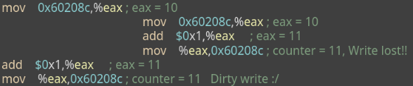

# Sincronización
Si recordamos los _threads_ como unidad básica de procesamiento
* Los _threads_ de un proceso comparten el mismo espacio de memoria
* Los _threads_ de un proceso son concurrentes (compiten por el uso de CPU)
* Los _threads_ en un sistema _multicore_ pueden ejecutarse en paralelo... deben ser **sincronizados**
<p align="center">
  
</p>

## _Race condition_
Situación el que la salida de una operación depende del orden temporal de sus operaciones inteernas, el cual no está bajo control del programador. El resultado depende de la entremezcla (_interleaving_) de sus _threads_. **Hay que evitar estas _race conditions_.**

## El problema de la sección crítica
La sección crítica es el segmento de código en que el _thread_ accede a recursos compartidos. Necesitamos de un protocolo que **no permita** que dos o más *threads* se encuentren en sus sección crítica al mismo tiempo.
```c
void mess_with_shared_things() {
    entry();
    /* do stuff with shared resources */
    leave();

    /* do other stuff */
}
```

### Soluciones al problema de la sección crítica
Deben cumplir:
* Exclusión mutua: a lo más un _thread_ puede estar en su sección crítica
* Progreso: al menos un _thread_ puede entrar en su sección crítica. Si ningún _thread_ está en su sección crítica y hay _threads_ que desean entrar, entonces los que quieren entrar deciden (en un tiempo acotado) quien entra.
* Espera acotada (ausencia de inanición): Si un proceso quiere entrar a su sección crítica, podrá hacerlo luego de una cantidad finita de tiempo.

<p align="center">
    
</p>

## Soluciones a las _Race Conditions_
### Deshabilitar interrupciones: atacar el problema de la raíz
* El problema ocurre cuando un _thread_ es interrumpido
* Si no hay interrupciones, no hay problema
* Esto delimita fuertemente el nivel de concurrencia.
* Esta solución usualmente la aplican los módulos del sistema operativo.

### Variable compartida `lock`
En el mundo del usuario estamos a la merced de las interrupciones, no pudemos simplemente desactivarlas.
```c
/* 0: libre/free | 1: ocupado/busy */
int lock = 0; 

/* cada thread debe incluir un código */
while (TRUE) {
    while (lock);   // busy waiting (spinlock)
    lock = 1;
    /* sección crítica */
    lock = 0;
    /* out of sc */
}
```
No es una solución muy buena, porque puede ocurrir _interleaving_ y que entren dos _threads_ a su sección crítica.
* No cumple Exclusión mutua
* Cumple Progreso

### Variable compartida `turn`
```c
/* 0: thread 0 | 1: thread 1... */
int turn = 0; 

/* cada thread debe incluir un código */
while (TRUE) {
    while (turn != ID);   // busy waiting (spinlock)
    /* sección crítica */
    turn = (id + 1) % n;
    /* out of sc */
}
```
* Cumple Exclusión mutua
* No cumple Progreso: puede ocurrir que un _thread_ no quiera entrar a su sección crítica en su turno.

### `turn` y `flag` compartidos: solución de Peterson 1981
```c
int turn = 0;
int flag[2] = {false, false};

/* cada thread debe incluir un código */
/* el ID es 0 o 1. Peterson es para DOS threads */
int me = ID;
int other = 1 - ID;
while (TRUE) {
    flag[me] = true;
    turn = other;
    while (flag[other] && turn == other);
    /* sección crítica */
    flag[me] = false;
    /* out of sc */
}
```
* Cumple Exclusión mutua
* Cumple Progreso

## Sincronización por _hardware_
Las soluciones por _software_ dependen de que existan **instrucciones atómicas** provistas por el _hardware_. Nos gustaría que tanto `while(lock)` como `lock = 1` fueran instrucciones atómicas.

### _Test and set_ (TAS)
Algunas arquitecturas proveen instrucciones atómicas del tipo `test_and_set`. La instrucción, que se ejecuta automáticamente, es **equivalente** a este _snippet_
```c
bool SOFTWARE_test_and_set(bool *target) {
    bool old_value = *target;
    *target = true;

    return old_value;
}
```
Esta instrucción ocurre de manera atómica si el _hardware_ lo soporta. Permite crear una segunda versión _naive_ de `lock`:
```c
bool lock = false;

/* cada thread debe incluir un código */
while (true) {
    /* ... ... ... */
    while (test_and_set(&lock));
    /* sección crítica */
    lock = false;
    /* out of sc */
}
```
* Cumple Exclusión mutua
* Cumple Progreso
* No cumple Espera acotada

### _Compare and swap_ (CAS, XCHG)
Código equivalente a `compare_and_swap`:
```c
int SOFTWARE_compare_and_swap(int *value, int expected, int new_value) {
    int previous = *value;

    if (value == expected) {
        *value = new_value;
    }

    return previous;
}
```
Esta instrucción ocurre de manera atómica si el _hardware_ lo soporta. Permite crear una tercera versión _naive_ de `lock`:
```c
int lock = 0;

/* cada thread debe incluir un código */
while (true) {
    /* ... ... ... */
    while (compare_and_swap(&lock, 0, 1) != 0);
    /* sección crítica */
    lock = 0;
    /* out of sc */
}
```
* Cumple Exclusión mutua
* Cumple Progreso
* No cumple Espera acotada

### Sección crítica para N procesos
```c
bool lock = false; // false: libre/free | true: ocupado/busy
bool waiting[N];   // todos inicializados en false

/* cada thread debe incluir un código */
while ('-') {
    waiting[i] = key = true;           // Im waiting and its locked 
    while (waiting[i] && key) {        
        key = test_and_set(&lock);
    }
    waiting[i] = false;                // Im no longer waiting
    /* sección crítica */
    j = (i + 1) % N;
    while (j != i && !waiting[j]) {
        j = ++j % N;                   // Find next waiting thread
    }
    if (j == i) {                      // No waiting threads
        lock = false;
    } else {                           // Wake up next waiting thread
        waiting[j] = false;
    }
    /* out of sc */
}
```
* Cumple Exclusión mutua
* Cumple Progreso
* Cumple Espera acotada

Todas estas soluciones que hemos presentado, se basan en **busy waiting**. Solo se justifica usar cuando se espera un tiempo de bloqueo muy corto. En este caso, se le llama _spinlock_. El _quantum_ se utiliza para hacer _busy waiting_, por lo que un wait muy grande puede ser muy costoso para nada.

# Abstracciones o primitivas de sincronización

## _Mutex locks_ 
* `Lock::acquire();` toma el lock
* `Lock::release();` libera el lock (error si no está tomado)
```c
struct Lock {
    bool value = false;
}

/* Implementación sin tanto busy waiting */
void acquire() {
    while (test_and_set(&value)){
        thread_yield();
    }
}
void release() {
    value = false;
}
```
### Problema del productor-consumidor
#### o problema del _bounded buffer_
* Un _buffer_ circular de tamaño limitado $N$
* Dos _threads_: un productor y un consumidor
* Todos los elementos del _buffer_ deben ser consumidos en orden

```c
int stock = 0;
T storage[N];

/* productor */
int in = 0;
while('p') {
    item = produce();
    while (stock == N) {    // storage full
        sleep();            // se bloquea en la cola waiting
    } 
    storage[in] = item;
    in = ++in % N;          // rotate index
    lock.acquire();
    stock++;
    lock.release();
    if (stock == 1) {
        wakeup(consumidor); // despierta al consumidor siesq está
    }
}

/* consumidor */
int out = 0;
while('c') {
    while (!stock) {        // storage empty
        sleep();            // se bloquea en la cola waiting
    }                       
    item = storage[out];
    out = ++out % N;        // rotate index
    lock.acquire();
    stock--;
    lock.release();
    if (stock == N - 1) {
        wakeup(productor);  // despierta al productor siesq está
    }
    consume(item);
}
```
¿Qué pasa si el consumidor es interrumpido antes de dormir? jacer `while`y luego `sleep` no es atómico. Tendríamos que implementar otra primitiva.

## Semáforos
Permiten un número limitado de _threads_ en una sección crítica. Básicamente es una etructura que tiene un contador y dos operaciones:
* `P()`: intenta decrementar el valor.
* `V()`: incrementa el valor.

Los semáforos sinrven para controlar el acceso a una región protegida. El mecanimsmo consiste en bloquearse (contador menor igual a cero) y avisar o señalar (contador mayor a cero). Así, las variables de condición permiten bloqurarse bajo condiciones arbitrarias.

```c
struct semaphore {
    int count;
    struct Lock lock;
    struct process* slept = NULL;
}

void init(c) {
    count = c;
}

void P() {                  // wait: put into queue and sleep
    lock.acquire();
    while (count <= 0) {
        /* code to ad itself to 'slept' */
        lock.release();
        sleep();
        lock.acquire();
    }
    count--;
    lock.release();
}

void V() {                  // signal: 
    lock.acquire();
    count++;
    wakeup(/*first from 'slept'*/)
    // plus, remove from queue
    lock.release();
}

```
### _Bounded buffer_ con semáforos
```c
struct lock l; int stock = 0; T storage[N];
struct semaphore full;  full.init(0);
struct semaphore empty; empty.init(N);

int in = 0;
while('p') {
    item = produce();
    empty.P();            // Wait one empty slot. P=='wait'=='down'
    l.acquire();
    storage[in] = item;
    in = ++in%N;                // rotate index
    stock++;
    lock.release();
    full.V();             // One more full slot. V=='signal'=='up'
}

int out = 0;
while ('c') {
    full.P()             // Wait one more item. P=='wait'=='down'
    lock.acquire();
    item = storage[out];
    out = ++out%N;             // rotate index
    stock--;
    lock.release();
    empty.V();           // One more empty slot. V=='signal'=='up'
    consume(item);
}
```

## Variables de condición
Se parece a un semáforo. Esta primitiva permite bloquear un _thread_ bajo una condición arbitraria. Se basa en dos operaciones:
* `Condition::wait()`: bloquea el _thread_ (**siempre**).
* `Condition::signal()`: despierta un _thread_ bloqueado, si lo hay.

### _Bounded buffer_ con variables de condición
Las _condition cariables_ utilizan un _locl_ y lo liberan antes de bloquearse.
```c
struct lock l; 
struct condition condCons, condProd;
int stock = 0; T storage[N];

int in = 0;
while('p') {
    item = produce();
    l.acquire();                        // with mutex
    while(stock == N) condProd.wait(l); // wait if full
    storage[in] = item;  in = ++in%N;   // fill and rotate index
    stock++;
    condCons.signal();                  // signal new item for consumer
    l.release();
}

int out = 0;
while ('c') {
    l.acquire();
    while(!stock) condCons.wait(l);     // wait if empty
    item = storage[out]; out = ++out%N; // extract and rotate index
    stock--;
    condProd.signal();                  // signal new slot for producer
    l.release();
    consume(item);
}
```

## Problema de los lectores y escritores
Modela el acceso a una base de datos compartida. Hay dos tipos de _threads_:
* Lectores: solo leen la base de datos. Pueden haber varios a la vez.
* Escritor: escriben en la base de datos. Solo puede haber uno a la vez.

```c
struct semaphore rw; rw.init(1); 
struct semaphore mutex; mutex.init(1); 
int readers = 0;        // leen o quieren leer

/* writers */
while('w') {
    rw.P();
    /* ... WRITE ... */
    rw.V();
}

/* readers */
while ('r') {
    mutex.P();
    readers += 1;
    if(readers == 1)
        rw.P();
    mutex.V();
    /* ... READ ... */
    mutex.P();
    readers -= 1;
    if(readers == 0)
        rw.V();
    mutex.V();
}
```

## Problema de los filósofos comensales
* $N$ filósofos comensales
* Cada filósofo tiene un plato de arroz y un palillo
* Cada filósofo necesita dos palillos para comer
* Cada filósofo puede comer solo o en compañía

```c
int left =  i;
int right = (i+1)%N;           // N==5
struct semaphore chopstick[N]; // inicializados en 1

do {
  chopstick[left].P();
  chopstick[right].P();

  /* eat */

  chopstick[left].V();
  chopstick[right].V();

  /* philosophise */

} while ('p');
```
Esta implementación puede causar un _deadlock_ si todos los filósofos toman el palillo de la izquierda al mismo tiempo. Esto se puede solucionar utilizando semáforos

```c
int N = 5;
enum {PHILOSOPHISE, HUNGRY, EATING} state[N];   /* free / waiting / using */
struct lock l;
struct semaphore philosopher[N]; // inicializados en 0

int left(i)  { return (i+N-1)%N; }
int right(i) { return (i+1)%N; }

/* */

void philosoph(int i) {
    while(TRUE) {
        think();
        take_forks();
        eat();
        release_forks();
    }
}

void take_forks(int i) {
    l.acquire();
    state[i] = HUNGRY;
    try_forks(i);
    l.release();
    philosopher[i].P();
}

/*  */

void release_forks(int i) {
    l.acquire();
    state[i] = PHILOSOPHISE;
    try_forks(left(i));
    try_forks(right(i));
    l.release();
}

void try_forks(int i) {
    if(state[i] == HUNGRY && state[left(i)] != EATING 
       && state[right] != EATING) {
        state[i] = EATING;
        philosopher[i].V();
    }
}
```