# Administración de memoria
La memoria del computador está organizada como un arreglo muy grande de _bytes_. Cada byte tiene una dirección única. La introducción de la multiprogramación trajo consigo dos problemas:

* Las variables no siempre están en la misma dirección. Requisito: relocalización de variables.
* Un proceso podría leer y modificar memoria de otro. Requisito: protección de memoria.

Es evidente entonces, que con multiprogramación, no nos sirven direcciones absolutas. Así, una solución es que el compilador no genera direcciones absolutas, si no que direcciones reubicables (e.g. `JMP 32+X`). Esto permite utilizar un espacio de direcciones.

<p align="center">
    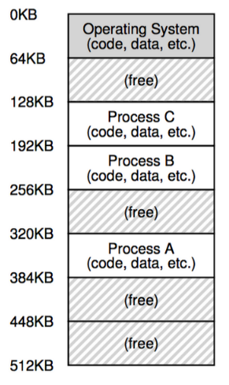
</p>

## Espacio de direcciones
Cuando uno obtiene las direcciones de memoria de un programa, lo que recibe son direcciones virtuales! Esta abstracción se llama espacio de direcciones.

El proceso mantiene un espacio **único** y **secuencial** (lineal) de direcciones. Un proceso de 16KiB utiliza direcciones de 0 a 16383. El sistema operativo mapea estas direcciones a direcciones físicas. Esto lo hace por _hardware_ en la _MMU_.
<p align="center">
    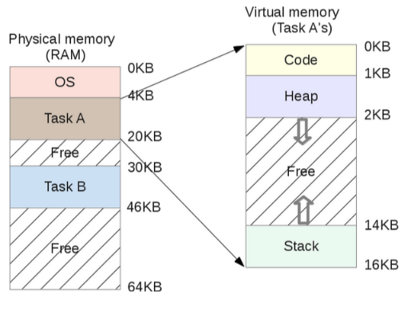
</p>

## Sobrecarga de memoria: ¿qué pasa si la memoria se llena?
El _mid term scheduler_ determina cuando hay que hacer operaciones de _swapping_. Esta operación utiliza una porción del disco, denominado espacio de _swap_. Acá se guardan imágenes de memoria de procesos. Así, los procesos pueden ser cargados y descargados de la memoria, lo que puede dejar algunos huecos...

<p align="center">
    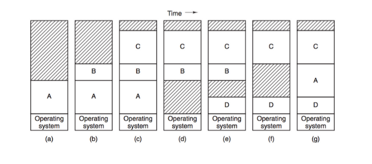
</p>

### Compactación
Una opción es realizar una operación de **compactación**, fusionando los huecos. Esto es muy costoso, ya que requiere mover todos los procesos en memoria. Algo mejor es asignar de manera inteligente los espacios de memoria para que nunca deba compactar. Esto da paso a las estrategias de alocación de memoria.

<p align="center">
    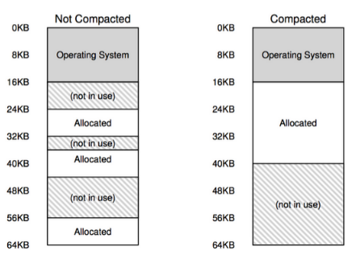
</p>

### Estrategias
* *First-fit*: asigna el primer hueco que encuentre.
* *Best-fit*: asigna el hueco más pequeño que encuentre.
* *Worst-fit*: asigna el hueco más grande que encuentre.

Cuando los espacios libres quedan separados se dice que hay **fragmentación**.

## Segmentación
Muchas veces los procesos requieren harta memoria, en general, es difícil tener un espacio de memoria físico en donde quepa por completo. La segmentación permite dividir un proceso en segmentos más pequeños, cada uno con su propio espacio de direcciones. Esto permite que cada segmento pueda ser cargado en memoria independientemente. Los segmentos son espacios de direcciones contiguos (segmentos: `code`, `heap`, `stack`, ...
). 

La _MMU_ mapea cada segmento a un espacio de memoria físico. Queda especificado en la tabla de segmentos. Esta tabla además especifica el tamaño de memoria que se la ha asignado, por lo que, todos reciben una asignación de memoria contigua, eliminando la fragmentación externa. Sin embargo, la fragmentación interna sigue existiendo. Esta consiste en los espacios sin utilizar dentro de un segmento.

<p align="center">
    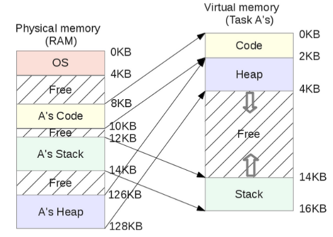
</p>

Necesito conocer el segmento y el _offset_. Con lógica de _bits_ es muy fácil. 

<p align="center">
    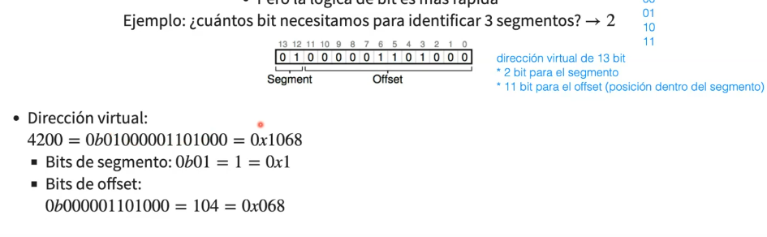
</p>

```c
SEG_MASK = 0x3000;
OFFSET_MASK = 0xFFF;
SEG_SHIFT = 12;
virtualAddress = 4200;
segment = (virtualAddress & SEG_MASK) >> SEG_SHIFT;
offset = virtualAddress & OFFSET_MASK;
if(offset >= size[segment])
    raise(SEG_FAULT);
else
    physicalAddress = base[segment] + offset;
```

Ahora, hay que tener cuidado, porque crece en sentido contrario. Así, se agrega un bit que indica el sentido en el que crece el segmento.

La segmentación elimina la fragmentación externa (espacios libres (sin asignar, no sin ocupar) no contiguos), sin embargo, sigue existiendo fragmentación (fragmentación interna, cuando se asigna más de lo pedido). Además, es difícil anticipar el tamaño de los segmentos.

### Visualización de segmentos
el comando `pmap` permite visualizar los segmentos de un proceso.

## Paginación
Podemos añadir una segunda idea para reducir la fragmentación: que los segmentos sean del mismo tamaño, así podemos utilizar páginas de memoria y una tabla de páginas.
* Espacio virtual: páginas.
* Espacio físico: marcos de página (_frames_ o _page frames_).
* Páginas y _frames_ del mismo tamaño.

### Tabla de páginas
* _offset_: offset o desplazamiento dentro de la página.
* VPN: número de página virtual.
* PFN: número de marco de página físico.
* VPN es traducido a PFN por la tabla de páginas.

En una arquitectura con espacio de direcciones virtuales de 32 bits, si cada página tiene 4KiB, entonces la tabla de páginas tiene 2^20 entradas (PTE, _page table entry_). Esto genera un problema enorme: la tabla de páginas tiene un espacio de 4MiB por proceso, espacio del sistema operativo.
<p align="center">
    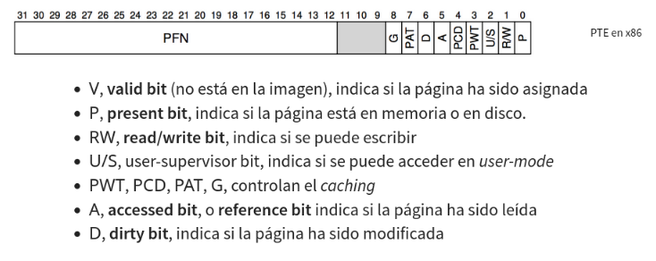
</p>

La dirección de la tabla de páginas se guarda en el PCB (_process control block_), como PTBR (_page table base register_). Así, cada acceso a memoria se convierte en dos accesos: primero se accede a la tabla de páginas, y luego a la memoria.

## Paginación con TLB
Recordando que cada vez que accedo a memoria, tenemos que primero acceder a la tabla de páginas, y luego a la memoria física. Esto es muy lento, por lo que se añade un caché de páginas, llamado TLB (_translation lookaside buffer_). Esta caché es una memoria _fully-asociative_, que guarda las últimas páginas accedidas. Así, se reduce el tiempo de acceso a memoria.
* Si la dirección está en la caché se produce un _TLB hit_ y se responde inmediatamente.
* Si la dirección no está en la caché se produce un _TLB miss_ y se lee desde la memoria y se actualiza el TLB.

<p align="center">
    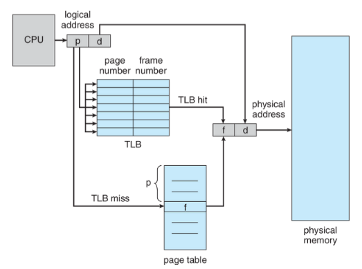
</p>

Así, recordando que el TLB se encuentra en la MMU, el acceso al TLB es considerablemente más rápdio que el acceso a la memoria principal para la tabla de páginas.

```c
 VPN = (virtualAddress & VPN_MASK) >> VPN_SHIFT;
 (Success, TLBEntry) = TLB_Lookup(VPN);
 if(Success) {         //TLB Hit: UN acceso a memoria
   if(!TLBEntry.protected) {
     offset = virtualAddress & OFFSET_MASK;
     physicalAddress = (TLBEntry.PFN << PFN_SHIFT) | offset;
     register = ReadMemory(physicalAddress);
   }
   else raise(PROTECTION_FAULT);
 }
 else {                //TLB Miss: DOS accesos a memoria
   PTEAddress = PageTableBaseRegister + (VPN * sizeof(PTE));
   PTE = ReadMemory(PTEAddress);
   if(!PTE.valid)          raise(SEG_FAULT);
   else if (PTE.protected) raise(PROTECTION_FAULT);
   else {
     TLB_Insert(VPN, PTE);
     Retry();
   }
 }
```

### Efectividad del TLB
Consideremos que queremos hacer acceso a `a[0]` hasta `a[9]`. Sin TLB se tienen 20 accesos a memoria, mientras que con TLB se accede a la tabla de páginas una vez por página, para traerla al TLB; además de los 10 accesos a memoria "obligatorios". 

<p align="center">
    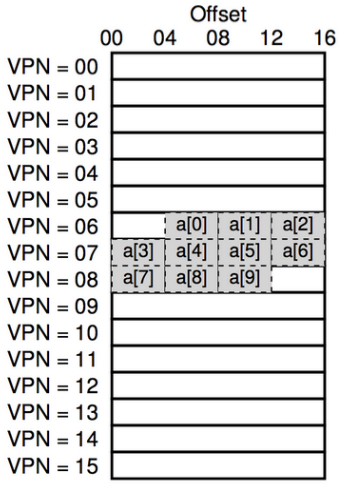
</p>

No siempre es ideal, hay que hacer cálculos para ver si vale la pena. Si el acceso al TLB es de 1ns y a memoria es de 100ns, significa que sin TLB el tiempo total fue de 2000ns y con TLB de 1310ns. Entonces con TLB es 1.52 veces de rápido. En realidad, el _hit rate_ suele ser más cercano a 99%. Esto ocurre por localidad espacial y localidad temporal.

#### ¿Dónde se guardan los datos de un TLB ante un cambio de contexto?
Las _page table entrys_ (PTE) de un proceso no sirven para otro proceso, así, la mejor opción es guardar en las _entrys_ del TLB el _address space ID_ (ASID) del proceso. Así, cuando se cambia de contexto, sabemos que las entrys con el mismo ASID que el proceso en contexto son válidas, y las demás no.

## Variantes de paginación
Recordando el problema de que las tablas de páginas pueden llegar a ser muy grandes, y que estas viven en el OS. Una solución es tener páginas más grandes, lo que permite necesitar menos páginas y una tabla de páginas más pequeña.

### Fragmentación interna
Esta corresponde a tener **espacio sobreasignado**, es decir, que a un proceso se le asigna más memoria de la que realmente necesita. Aumentar el tamaño de las páginas aumenta el problema de fragmentación interna!

#### Segmentación de la tabla de páginas
Por otro lado, los proceso no suelen ocupar todas sus páginas, por lo que con **segmentos paginados**, se tiene una tabla de páginas por segmento, por lo que se tiene tablas de páginas mas pequeñas. Pero vuelve la fragmentación externa!

#### Paginación multinivel
La idea es la siguiente, en vez de segmentar la tabla de páginas, paginarla de nuevo.

* En memoria se necesitala tabla de páginas de primer nivel (completa), y una tabla de cada nivel para poder resolver una dirección física.
* Cada división puede tener distintos tamaños.

<p align="center">
    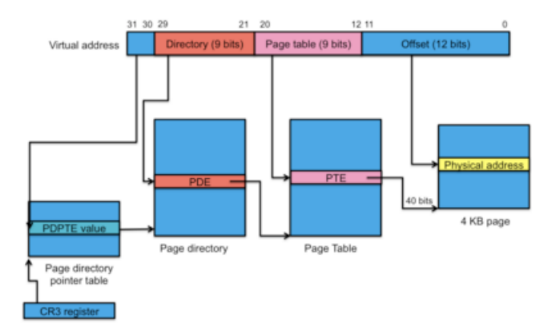
</p>

La paginación multinivel no cambia la cantidad de memoria direccionable total, sino que, cambia la cantidad de entradas de tablas de páginas necesarias en memoria. 


## Reemplazo de páginas
Procesos pueden tener parte de su memoria no cargada aun (en disco) o en _swap_ (en disco).
El desafío es como utilizar efectivamente el disco (grande pero lento) para proveer la ilusión de que todo el espacio virtual está en memoria.
### _Swap space_
* Tabla de páginas utiliza un bit de presencia para saber si una página está en un _page frame_ o no. En caso negativo, se genera un _page fault_ lo que activa el mecanismo de recuperación de una página desde disco a memoria física: 
* Sistema operativo atiende el _page fault_
* Cuando el _page fault_ ha sido resuelto, el proceso puede continuar.

Como dijimos, ante un _page fault_, el sistema operativo va a buscar la página. Algoritmo para buscar la página:

```c
VPN = (virtualAddress & VPN_MASK) >> VPN_SHIFT;
(Success, TLBEntry) = TLB_Lookup(VPN);
if(Success) {         //TLB Hit
if(!TLBEntry.protected()) {
    offset = virtualAddress & OFFSET_MASK;
    physicalAddress = (TLBEntry.PFN << PFN_SHIFT) | offset;
    register = ReadMemory(physicalAddress);
}
else raise(PROTECTION_FAULT);
}
else {                //TLB Miss
PTEAddress = PageTableBaseRegister + (VPN * sizeof(PTE));
PTE = ReadMemory(PTEAddress);    // lectura tabla de paginas
if(!PTE.valid)          raise(SEG_FAULT);
else if (PTE.protected) raise(PROTECTION_FAULT);
else if (!PTE.present)  raise(PAGE_FAULT);
else {                  // pagina en memoria
    TLB_Insert(VPN, PTE);
    Retry();
}
}
```
Algoritmo para panejar un _page fault_:

```c
PFN = FindFreePhysicalPage();   // busca frame libre
if(PFN == -1)                   '// no había frame libre :'(
PFN = ReplacePage();          // rutina de reemplazo de página

// Copia desde el disco a la memoria. Proceso queda "waiting on I/O"
DiskRead(PTE.DiskAddress, PFN);

// Actualiza tabla de páginas
PTE.present = TRUE;
PTE.PFN = PFN;

// Vuelve a ejecutar la instrucción que generó el PAGE_FAULT 
Retry(); 
```

### Aloritmos de reemplazo: ¿qué página reemplazar?
Cualquier algoritmo de decisión debe intentar minimizar la ocurrencia de _page faults_.

#### OPT / MIN
Elegir la página que será utilizada lo más lejos posible en el futuro. Es el algoritmo ideal, pero no se puede implementar porque no se conoce el futuro :'(

#### FIFO
* Muy simple de implementar.
* Elegir la página que lleva más tiempo en memoria.
* Uno podría pensar que a mayor cantidad de _frames_ se comporta mejor, pero esto no siempore es cierto.

#### RANDOM
* Puede tener rendimiento promedio mejor a FIFO.
* Al igual que FIFO, no aprovecha la localidad de referencia.

#### LRU (_least recently used_)
* Elegir la página que no ha sido utilizada por más tiempo.
* Rendimiento similar a MIN
* Es implementable
* Nos queda la duda si es realmente eficiente por tener que estar manejando una cola.

### _Workload_
#### _Workload_ sin localidad
* Todas las políticas que podemos implementar se comportan casi igual.
* Con suficientes _frames_ disponibles se llega a un _hit rate_ de 1.

<p align="center">
    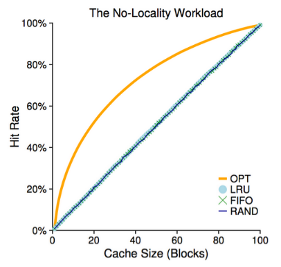
</p>

#### _Workload_ con localidad
* LRU mejor que FIFO y RANDOM
* Patrón más común

<p align="center">
    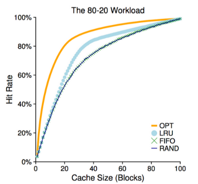
</p>
#### _Workload_ con _loop_ secuencial
* FIFO y LRU eliminan las páginas más antiguas
* RANDOM se comporta mejor
* Es el peor caso para FIFO y LRU
* Es un patrón común en muchas aplicaciones

<p align="center">
    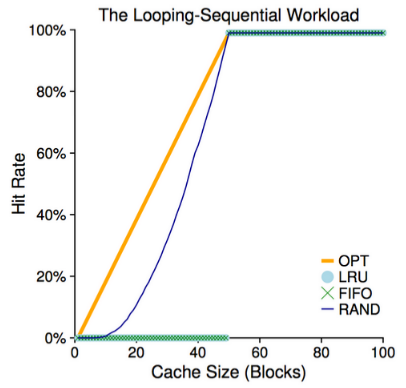
</p>

### Implementando LRU
* Hay que actualizar una cola **para cada acceso**. Mantener esta cola ordenada es caro.
* Podemos agregar un _timestamp_ por _hardware_ a cada página. Utilizar esto requiere comparar todos los _timestamps_ para encontrar el mínimo, lo que es caro.

### Aproximando LRU
#### Algoritmo del reloj (_clock_)
Aproximación basada en el _reference bit_
* Algoritmo apunta a una página cualquiera
* Al momento de elegir se mira el _reference bit_:
    - Si es 1, se cambia a 0 y se pasa a la siguiente página
    - Si es 0 se elige
* Aproxima LRU bastante bien y es eficiente

<p align="center">
    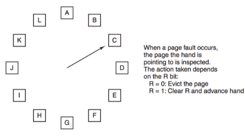
</p>

#### Algoritmo de _aging_
Si nos enfocamos en múltiples _reference bits_ se obtiene una mejor aproximación de LRU.
* Contadores se actualizan por _hardware_ a intervalos regulares
* En cada _tick_, los _reference bit_ se copian a cada contador (_shift left_) y se borran.
* La secuencia de bits sirve como historial.
* La página con el menor contador es la menos utilizada.

<p align="center">
    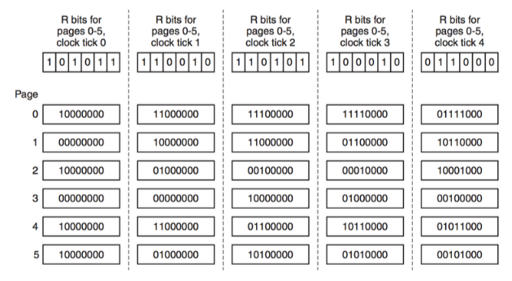
</p>

#### Usando el _dirty bit_
Permite priorizar mejor las páginas para el algoritmo de reloj.

Reference | Dirty | Descripción
--------- | ----- | ---
0 | 0 | No usada recientemente ni modificada. Buena candidata.
0 | 1 | No usada recientemente pero modificada.
1 | 0 | Usada recientemente pero no modificada.
1 | 1 | Usada recientemente y modificada.

Cuando una página no ha sido modificada no es necesario escribirla en disco! :D

## _Working set_ y _Thrashing_
El modelo _working set_ $w_\Delta (t)$ intenta determinar si un proceso tiene una cantidad apropiada de _frames_ asignados. Se define como el conjunto de páginas utilizadas por un proceso en los últimos $\Delta$ accesos a memoria. 
* Se le puede considerar una medida efectia de la demanada por _frames_ de un proceso.
* Si no se le puede asignar $|w_\Delta (t)|$ _frames_, entonces no conviene tenerlo en ejecución.
* Si la suma de los _wotrking set_ de todos los procesos es mayor que la cantidad de _frames_ disponibles, entonces se produce _thrashing_.
* El _working set_ es usado por el _medium term scheduler_ y puede ser implementado utilizando los _reference bits_.
