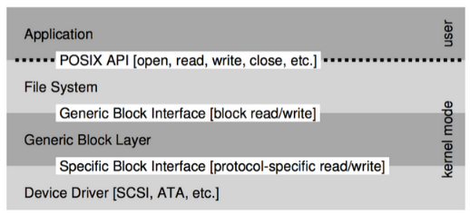
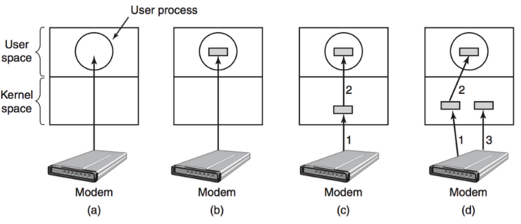
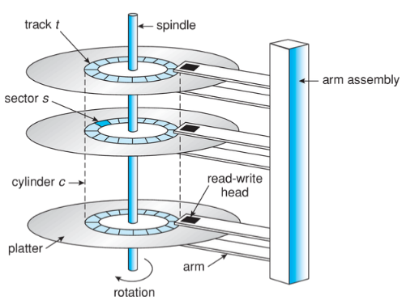
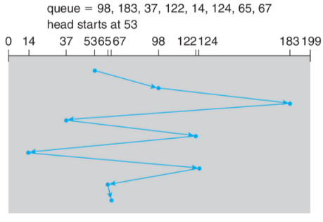
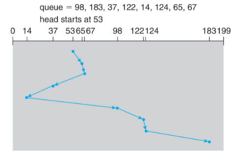
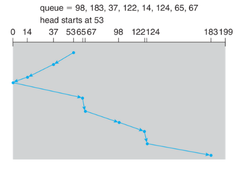
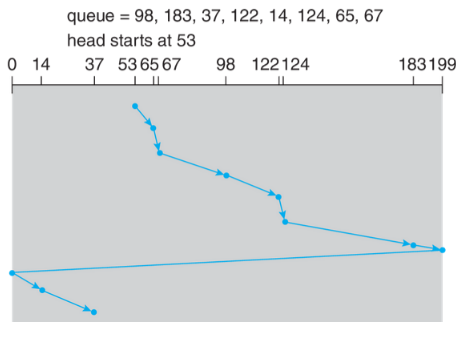
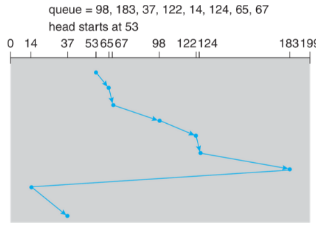
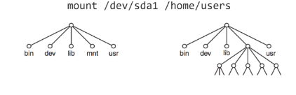

# Archivos y administración de almacenamiento
# Dispositivos de I/O
## Acceso a dispositivos de I/O: Drivers
* _Device driver_: Código específico para la interacción con un dispositivo. Provee una interfaz específica para hablar con en dispositivo.
* _Block layer_: Capa intermedia. Abstracción de bloques de disco.
* Sistema de archivos: Capa visible al programador mediante API.

<p align="center">

</p>

(70% del código de Linux es para _drivers_ :O)

## Transferencia de datos: _Buffers_
* Lectura directa. _Unbuffered_. Lento.
* _Buffer_ en _user space_. Página puede ser _swapped out_.
* _Buffer_ en _kernel space_. Se transfiere al llenarse.
* _Double-buffer_. Mientras uno se transfiere, se escribe en el otro.

<p align="center">

</p>

# Sistemas de disco
Funcionan princialmente como memoria secundaria con almacenamiento de alta capacidad. Es más lenta que el almacenamiento principal. Es memoria no volatil.

## Discos magnéticos
* Brazos se mueven juntos.
* Brazos poseen cabezales lectores.
* Platos divididos en _tracks_ circulares.
* _Tracks_ divididos en secotres: bloques de 512 Bytes
* Conjunto de _tracks_ entre varios platos forman un cilindro.
* Velocidades de rotación: 5400, 7200, 10000, 15000 RPM.

<p align="center">

</p>

El hecho de que el disco sea mecánico implica que hay un tiempo de latencia para la lectura.
* Latencia rotacional: búsqueda en un _track_.
* _Seek time_: Cambio de _track_.

## Discos de estado sólido 
* Sin _seek time_ ni latencia rotacional.
* Más rápidos
* Más costosos ($) por MB.
* Menor consumo eléctrico.
* Celdas poseen cantidad limitada de reescrituras. Las celdas se van desgastando :(


# Formateo de disco
### Formateo de bajo nivel o formateo físico
* Crea estructura de sectores: header+data+trailer (incluyendo ECC)
* Ejecutado en fábrica
* _Low-level Formatting_ equivale a regresar a valores de fábrica
## Particionamiento
* Agrupación de sectores **contiguos** para ser tratados cada conjunto como si fueran discos separados.
* Tabla de particiones accesible en _Master Boot Record_ (MBR).
* MBR: 32-bit para direccionar bloques de 512 Bytes.
* Los sistemas modernos utilizan GPT (GUID Partition Table).

## Formateo lógico
* Estructuras para sistema de archivos en una partición.

# _Scheduling_ de accesos
El sistema operativo solicita datos del disco especificando:
* Lectura o escritura.
* Dirección de disco (CHS o LBA).
* Dirección de memoria física (_buffer_).
* Número de sectores a trasnferir.

El sistema operativo puede encolar y ordenar las solicitudes: El orden de atención determina el _seek time_ de la transferencia.

## _Scheduling_ FCFS
Justo pero no necesariamente el de mejor servicio. No optimiza.

<p align="center">

</p>

## _Shortest seek time first_ (SSTF)
* Mejor que FCFS
* No es óptimo porque puede causar posible inanición de sectores alejados!
<p align="center">

</p>

## _Scheduling_ de tipo _Scan_ (Elevador)
* El brazo de mueve de un extremo a otro y sirve (_serves_) todo lo que encuentre en el camino y se haya pedido.
* Una posible desventaja es que cambiar de dirección puede ser un poco costoso.
<p align="center">

</p>

## _Scheduling_ de tipo _C-scan_ (Elevador circular)

<p align="center">

</p>

## _Scheduling_ _look_ y _c-look_
* Similares a _scan_ y _c-scan_ pero no de mueven hasta los extremos si no es necesario.

<p align="center">

</p>

# Sistemas de archivos
## Archivos
Un archivo corresponde a una colección de información en almacenamiento secundario.
* Unidad mínima de almacenamiento para el usuario.
* Agrupación lógica de bytes.
* Abstracción.
* El contenido puede ser cualquier cosa:
    - El significado está determinado por la forma en que se utiliza su contenido.
    - Texto, imagen, código fuente, código binario ejecutable, etc.

### Caracterizando un archivo
* Nombre (_low level_), también conocido como _inode number_ o número de inodo.
* Nombre (simbólico) para lectura humana.
* Tipo. Determinado por contenido. La extensión es solo convención.
* Ubicación. Puntero a dirrección de disco.
* Tamaño actual de bytes o blocks. Puede incluir un tamaño máximo.
* Protección. Datos de control de acceso. Lectura, escritura, ejecución.
* Fecha. Creación, acceso, modificación.
* Usuario. Propietario.
* Atributos extendidos (metadata): Codificación, checksum, programas asociados.

Se recomienda correr estos comandos es tu máquina :D
```bash
$ ls -i <file>
$ ls -al 
$ ls -alh
$ stat <file>
```

### Modos de acceso de un archivo
**[Este video](https://www.youtube.com/watch?v=mbBpewljGls&list=PLVTkEjeczcER2aOMHPIfaHCpTx61iKsoV&index=43) explica muy bien los modos de acceso de un archivo, incluyendo `chmod` lo que es muy práctico. Acuérdate de agregarlo acá.**

## Directorios
Los archivos se organizan en una estructura de directorios (otra abstracción)
* Nombre (low-level name): inode number
* Contiene lista de pares: (readable name, low-level name)
* Puede contener otros directorios: jerarquía o árbol de directorios
    - Jerarquía empieza en una raíz: `root`, o `/`
    - Usa un separador: `/`
    - Unidades son subdirectorios
* Nombres con subdirectorios: pathname o ruta
    - Ruta absoluta: Absolute path
            `/foo, /bar/bar, /bar/foo/bar.txt`
    - Ruta relativa: Relative path
            `foo, foo/bar.txt, foo/bar.txt`
    - Ruta absoluta no puede repetirse

## API de sistemas de archivos
Interfaz para poder manipular tanto archivos como directorios.
Algo interesante es que copiar un archivo es muy costoso, pero moverlo es muy simple pues solo se renombra en ruta absoluta :D

## Links
Se trata de una manera de compartir archivos o de compartir accesos a archivos, permitiendo que sea accesible desde rutas absolutas diferentes.
* _Symbolic link_: link apunta al **nombre de archivo** (`ln -s`) (_symlink_)
* _Hard link_: link apunta a un **archivo**, al mismo bloque de disco teniendo el mismo número de inodo (`ln`)

## Montando un sistema de archivos
El sistema puede manejar múltiples sistemas de archivos en un disco (mediante particiones). Para acceder a los sistemas de archivs se necesita un punto de acceso o _mountpoint_. El sistema operativo integra el sistema de archivos a la jerarquía actual utilizando `mount`:

<p align="center">
    
</p>