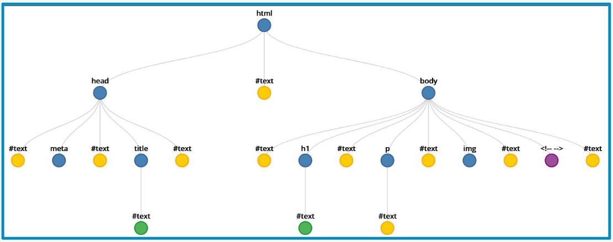
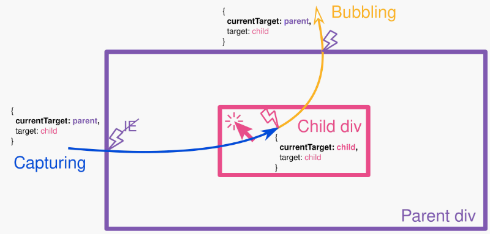

# JavaScript en el Navegador
## HTML DOM desde JavaScript
El HTML DOM es un estándar sobre cómo obtener, cambiar, agregar o eliminar elementos HTML:
* JavaScript puede hacer consultas y cambios sobre el DOM.
* Accesible como **variable global** en el navegador (window, this).
### Jerarquía de nodos
* El nodo raíz (tag html) se encuentra en window.document.
* Los nodos y los elementos son diferentes: estos últimos son tags HTML (azules en la imagen).

### Acceso a nodos
Podemos acceder a los nodos de diferentes formas:
* Según su id:
    * getElementById
* Según su tag HTML:
    * getElementsByTagName
    * getElementsByTagNameNS
* Según su clase CSS:
    * getElementsByClassName
* Según su nombre (usado en forms):
    * getElementsByName
### Algunas propiedades de nodos
* Identidad:
    * nodeName indica el tipo de elemento (P, DIV, etc.) o su #identificador.
* Jerarquía estructural:
    * parentNode
    * nextSibiling, previousSibling
    * nextElementSibiling, previousElementSibiling
    * firstChild, lastChild
    * firstElementChild, lastElementChild
* Acceso a atributos de elementos:
    * getAttribute
    * setAttribute

### Métodos que probablemente utilizarás
Métodos relacionados con el contenido:
* `Node.textContent` Entrega un string con contenido de todos los elementos.
* `HTMLElement.innerText` Entrega un string con el contenido “leíble”.
* `Element.innerHTML` Retorna HTML dentro de un elemento.
* `Element.outerHTML` Igual al anterior, pero incluye al elemento mismo.
* `Element.getAttribute/setAttribute`: Valores de atributos en un elemento.
Métodos relacionados con el estilo:
* `element.classList.add("my-class")` agregar una clase.
* `element.style.color` para cambiar el color.
* `document.querySelector()` retorna el primer elemento que coincide con el selector (que debe ser un selector válido en CSS).

## Eventos del navegador
Existen distintos tipos de eventos que se pueden capturar en el navegador:
* Eventos del mouse: selección, clicks, movimiento, hover, ...
* Eventos del teclado: pulsación de teclas, ...
* Eventos de la ventana: scroll, resize, cierre de la ventana, ...
* Eventos del foco: focus, blur, ...
* Eventos de tiempo
* Cambios de valor en un _input_, _form_, _select_, ...
* Y muchos más...
### Manejo de eventos: _event listener_
Para definir un _event handler_ se especifican tres cosas:
1. Qué pasó: el evento de interés.
2. Dónde pasó: el elemento de interés.
3. Qué hacer: código que se ejecuta cuando el evento ocurre.
```js
const btn = document.querySelector('button');

function random(number) {
  return Math.floor(Math.random()*(number+1));
}

btn.addEventListener('click', () => {
  const rndCol = `rgb(${random(255)}, ${random(255)}, ${random(255)})`;
  document.body.style.backgroundColor = rndCol;
});
```
### Maneras de definir un _event listener_
1. En el código HTML:
```html
<button onclick="algunaFuncion();"></button>
```
2. Con JS usando el DOM:
```js
btn.addEventListener('click', () => {
  // ...
});
```
### El objeto _event_
Los _event listeners_ reciben un objeto `Event` con ciertas propiedades
* type: nombre del evento.
* timeStamp: momento en el que se creó el evento.
* currentTarget: elemento que contenía al _event listener_.
* target: elemento que disparó el evento.
<p align="center">
    
    <a href="https://stackoverflow.com/questions/10086427/what-is-the-exact-difference-between-currenttarget-property-and-target-property/65377845#65377845">What is the exact difference between currentTarget property and target property in JavaScript</a> 
</p>

## Almacenamiento de datos
Tanto `localStorage` como `sessionStorage` son objetos de almacenamiento. Ambos permiten guardar pares llave-valor y su memoria está asociada a un orígen particular (dominio/puerto/protocolo):
* `localStorage` es persistente: los datos no se borran cuando se cierra el navegador.
* `sessionStorage` es temporal: los datos se borran cuando se cierra el navegador.
Ambos almacenan llaves y valores como `strings`:
```js
localStorage.valorImportante = 'Un valor';
localStorage.setItem('valorImportante', 'Un valor');
sessionStorage['otroValor'] = 2;
console.log(typeof sessionStorage["otroValor"]);
```

