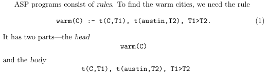

# _Answer Set Programming_ (ASP)
Utilizamos la herramienta [clingo](https://potassco.org/clingo/) para resolver problemas de programación de conjuntos de respuestas (ASP). Para ello, se debe escribir un programa en el lenguaje de programación de conjuntos de respuestas (ASP) y ejecutarlo con la herramienta clingo. El programa debe ser escrito en un archivo de texto con extensión `.lp` y se ejecuta con el comando `clingo <archivo.lp>`.
 
Los programas ASP se componen de hechos y reglas. Los hechos son declaraciones que se asumen verdaderas y son de la forma `p(a1, a2, ..., an).` donde no necesariamente existen argumentos. Es más fácil viéndolo de la forma `fact.`. Las reglas son declaraciones que se asumen verdaderas si se cumplen sus antecedentes y son de la forma `head :- body.`. El _body_ puede incluir varios átomos separados por comas, indicando que todos ellos deben cumplirse para que la regla sea verdadera. Estos se conocen como _constraints_ y también se pueden incluir comparaciones como `X < Y` o `X = Y`. 
 

 
Al ejecutar el programa, clingo retorna un _Answer Set_ o un conjunto de **modelos**. La aparición de más de un modelo se puede lograr mediante la inclusión de _choice rules_. Estas son de la forma ...
