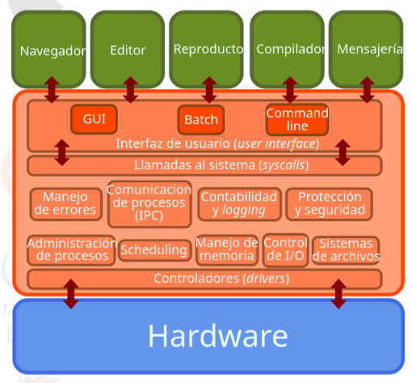
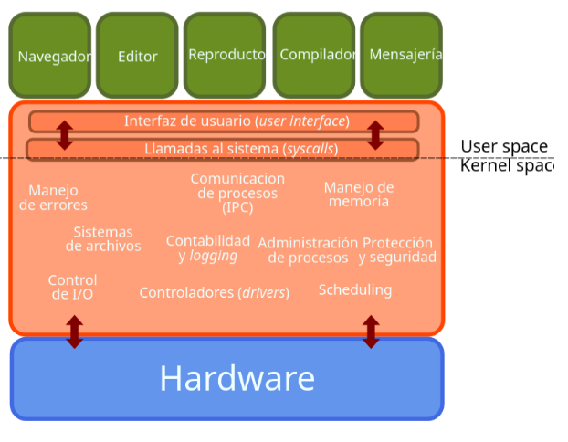
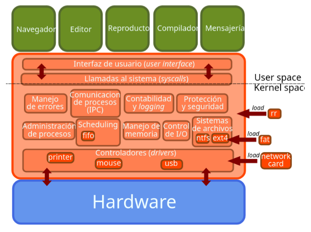
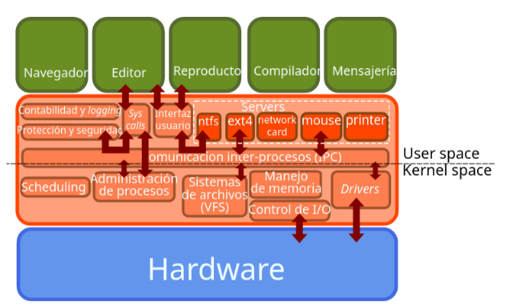
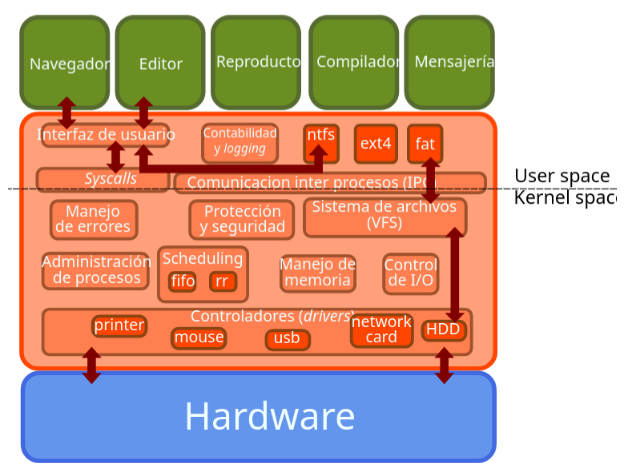

# Introducción a los sistemas operativos
Keywords: kernel, monolítico, microkernel, kernel híbrido, user interface, GUI, CLI, BATCH. 

## ¿Qué es un sistema operativo? 

Un sistema operativo está compuesto de un kernel y de los programas del sistema. Es nuestro servidor más importante. 

## Roles del OS 
### ¿Para qué queremos usar un sistema operativo? 

1. Nos abstrae del hardware (y de sus ciclos fetch, decode, execute). 

2. Permite compartir recursos entre rutinas (rol de administrador de recursos).  

3. Hace más cómodo el uso de hardware.   

4. Permite correr diferentes arquitecturas. 

## Estructura de un OS 
### ¿Qué hay dentro de un OS? 

 

## Syscalls 
Permiten la comunicación de los programas con el OS. Los programas invocan servicios del OS. 
Los OS proveen librerias en algún lenguaje de programación para invocar las syscalls.  

## ¿Cómo interactuamos con el OS? 

1. GUI 

2. CLI 

3. Batch (lotes) 

## Kernel 

* El kernel tiene control completo sobre el hardware. 
* Es el único programa que se ejecuta en modo privilegiado. 
* El resto se ejecuta en modo usuario. 

## Arquitecturas de kernel 

### Kernel monolítico 

* Todo dentro de un solo programa. 
* Todos los servicios se ejecutan en modo privilegiado o modo kernel. 
* La falla de un servicio compromete al kernel. 
* Ejecución más rápida. 

 

 

### Microkernel 

* Solo servicios básicos en el kernel. 
* Las funcionalidades se ejecutan en el user space. 
* Errores en los servicios no comprometen todo el kernel. 
* Kernel más pequeño, sencillo y fácil de portar. 

 

### Kernel híbrido 
* Construido como monolítico con módulos con funcionalidades que se ejecutan en el user space. 

    

Links 
1. Página del curso: http://iic2333.ing.puc.cl/slides/0-os.html#/ 
2. Linux cluster: https://www.suse.com/suse-defines/definition/linux-cluster/ 
3. TUI: https://en.wikipedia.org/wiki/Text-based_user_interface 
4. Cómo crear tu propia syscall: https://brennan.io/2016/11/14/kernel-dev-ep3/ 
5. Página de proyectos: https://brennan.io/projects/ 