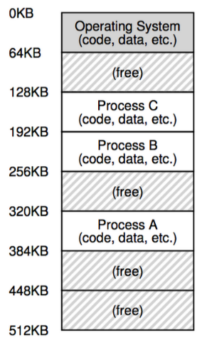
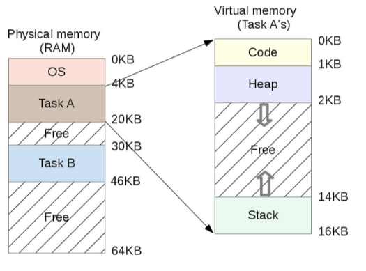
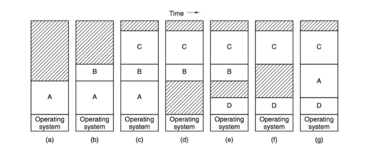
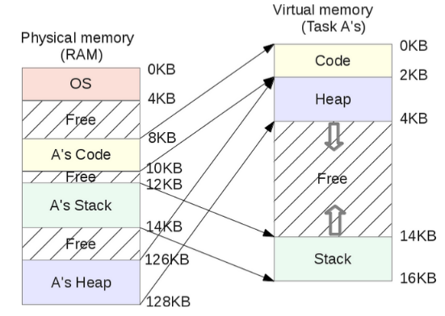
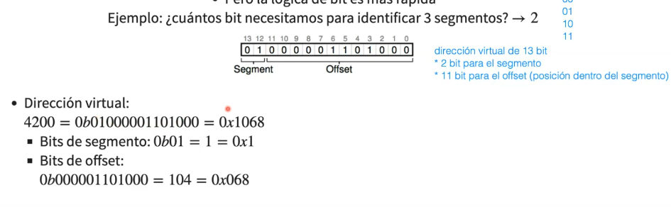
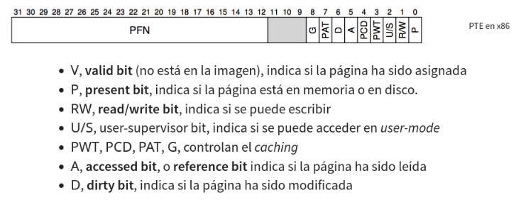

# Administración de memoria
La memoria del computador está organizada como un arreglo muy grande de _bytes_. Cada byte tiene una dirección única. La introducción de la multiprogramación trajo consigo dos problemas:

* Las variables no siempre están en la misma dirección. Requisito: relocalización de variables.
* Un proceso podría leer y modificar memoria de otro. Requisito: protección de memoria.

Es evidente entonces, que con multiprogramación, no nos sirven direcciones absolutas.

<p align="center">
    
</p>

## Espacio de direcciones
Cuando uno obtiene las direcciones de memoria de un programa, lo que recibe son direcciones virtuales! Esta abstracción se llama espacio de direcciones.

El proceso mantiene un espacio **único** y **secuencial** (lineal) de direcciones. Un proceso de 16KiB utiliza direcciones de 0 a 16383. El sistema operativo mapea estas direcciones a direcciones físicas. Esto lo hace por _hardware_ en la _MMU_.
<p align="center">
    
</p>

## Sobrecarga de memoria: ¿qué pasa si la memoria se llena?
El _mid term scheduler_ determina cuando hay que hacer operaciones de _swapping_. Esta operación utiliza una porción del disco, denominado espacio de _swap_. Acá se guardan imágenes de memoria de procesos. Así, los procesos pueden ser cargados y descargados de la memoria, lo que puede dejar algunos huecos...

<p align="center">
    
</p>

Una opción es realizar una operación de compactación, fusionando los huecos. Esto es muy costoso, ya que requiere mover todos los procesos en memoria. Algo mejor es asignar de manera inteligente los espacios de memoria para que nunca deba compactar.

### Estrategias
* *First-fit*: asigna el primer hueco que encuentre.
* *Best-fit*: asigna el hueco más pequeño que encuentre.
* *Worst-fit*: asigna el hueco más grande que encuentre.

Cuando los espacios libres quedan separados se dice que hay **fragmentación**.

## Segmentación
Muchas veces los procesos requieren harta memoria, en general, es difícil tener un espacio de memoria físico en donde quepa por completo. La segmentación permite dividir un proceso en segmentos, cada uno con su propio espacio de direcciones. Esto permite que cada segmento pueda ser cargado en memoria independientemente. Los segmentos son espacios de direcciones contiguos. La _MMU_ mapea cada segmento a un espacio de memoria físico. Queda especificado en la tabla de segmentos.

<p align="center">
    
</p>

Necesito conocer el segmento y el _offset_. Con lógica de _bits_ es muy fácil. 

<p align="center">
    
</p>

```c
SEG_MASK = 0x3000;
 OFFSET_MASK = 0xFFF;
 SEG_SHIFT = 12;
 virtualAddress = 4200;
 segment = (virtualAddress & SEG_MASK) >> SEG_SHIFT;
 offset = virtualAddress & OFFSET_MASK;
 if(offset >= size[segment])
   raise(SEG_FAULT);
 else
   physicalAddress = base[segment] + offset;
```

Ahora, hay que tener cuidado, porque crece en sentido contrario. Así, se agrega un bit que indica el sentido en el que crece el segmento.

La segmentación ayuda a eliminar la fragmentación externa (), sin embargo, sigue existiendo fragmentación. Además, es difícil anticipar el tamaño de los segmentos.

### Visualización de segmentos
el comando `pmap` permite visualizar los segmentos de un proceso.

## Paginación
Podemos añadir una segunda idea para reducir la fragmentación: que los segmentos sean del mismo tamaño, así podemos utilizar páginas de memoria y una tabla de páginas.
* Espacio virtual: páginas.
* Espacio físico: marcos de página (_frames_ o _page frames_).
* Páginas y _frames_ del mismo tamaño.

### Tabla de páginas
* _offset_: offset o desplazamiento dentro de la página.
* VPN: número de página virtual.
* PFN: número de marco de página físico.
* VPN es traducido a PFN por la tabla de páginas.

En una arquitectura con espacio de direcciones virtuales de 32 bits, si cada página tiene 4KiB, entonces la tabla de páginas tiene 2^20 entradas (PTE, _page table entry_). Esto genera un problema enorme: la tabla de páginas tiene un espacio de 4MiB por proceso, espacio del sistema operativo.
<p align="center">
    
</p>

La dirección de la tabla de páginas se guarda en el PCB (_process control block_), como PTBR (_page table base register_). Así, cada acceso a memoria se convierte en dos accesos: primero se accede a la tabla de páginas, y luego a la memoria.

## Paginación con TLB
...
## 03-05
...
## Paginación multinivel
