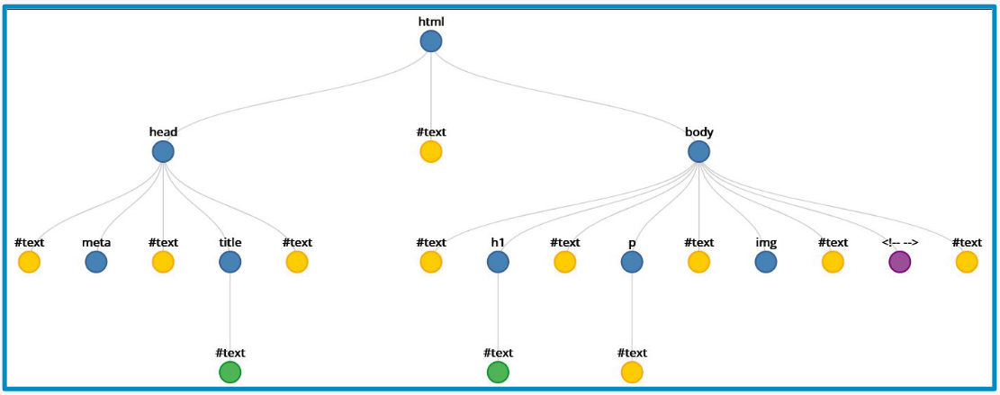

# JavaScript en el Navegador
## HTML DOM desde JavaScript
El HTML DOM es un estándar sobre cómo obtener, cambiar, agregar o eliminar elementos HTML:
* JavaScript puede hacer consultas y cambios sobre el DOM.
* Accesible como **variable global** en el navegador (window, this).
## Jerarquía de nodos
* El nodo raíz (tag html) se encuentra en window.document.
* Los nodos y los elementos son diferentes: estos últimos son tags HTML (azules en la imagen).

## Acceso a nodos
Podemos acceder a los nodos de diferentes formas:
* Según su id:
    * getElementById
* Según su tag HTML:
    * getElementsByTagName
    * getElementsByTagNameNS
* Según su clase CSS:
    * getElementsByClassName
* Según su nombre (usado en forms):
    * getElementsByName
## Algunas propiedades de nodos
* Identidad:
    * nodeName indica el tipo de elemento (P, DIV, etc.) o su #identificador.
* Jerarquía estructural:
    * parentNode
    * nextSibiling, previousSibling
    * nextElementSibiling, previousElementSibiling
    * firstChild, lastChild
    * firstElementChild, lastElementChild
* Acceso a atributos de elementos:
    * getAttribute
    * setAttribute

...
